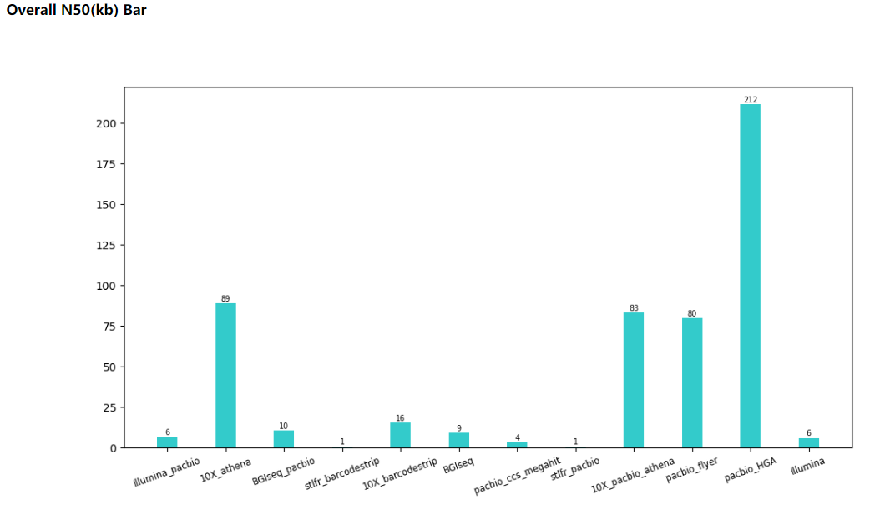
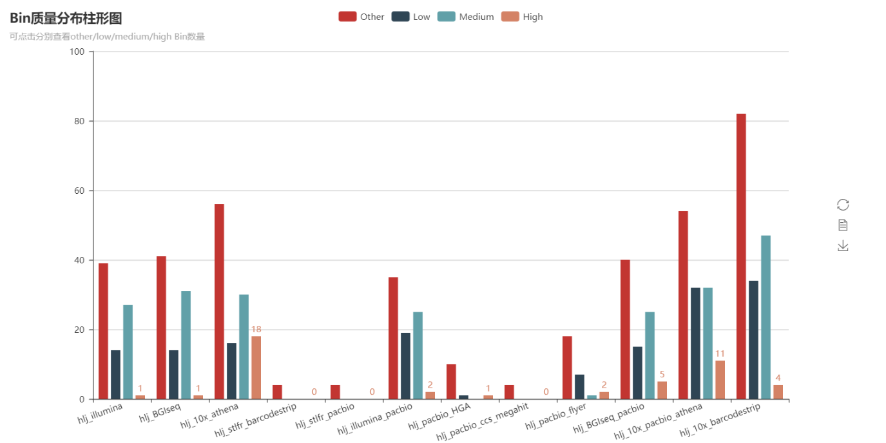
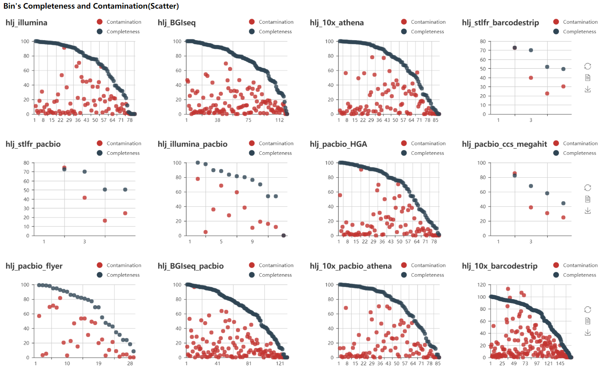
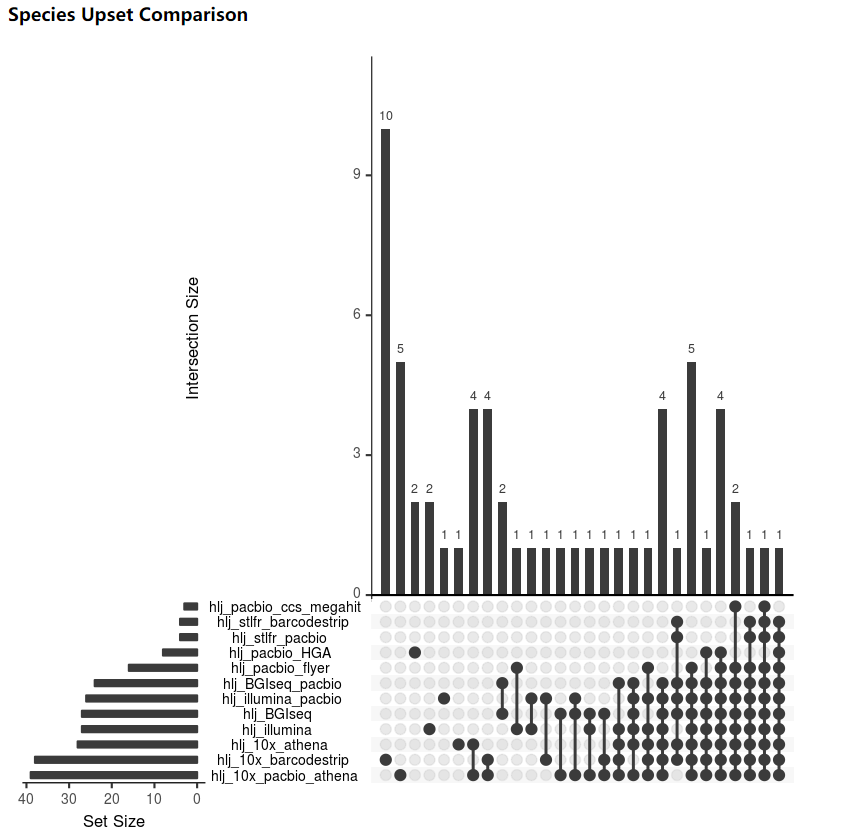
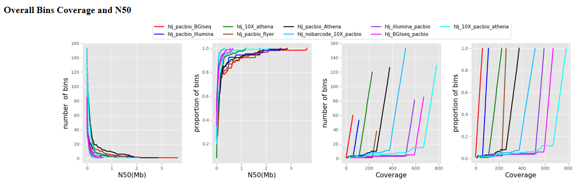
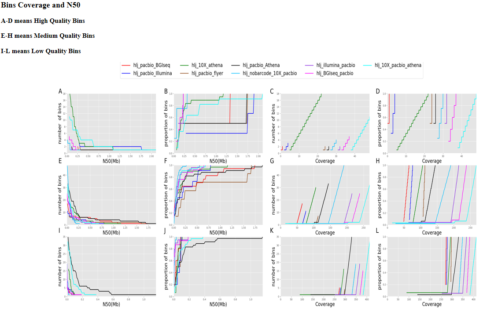
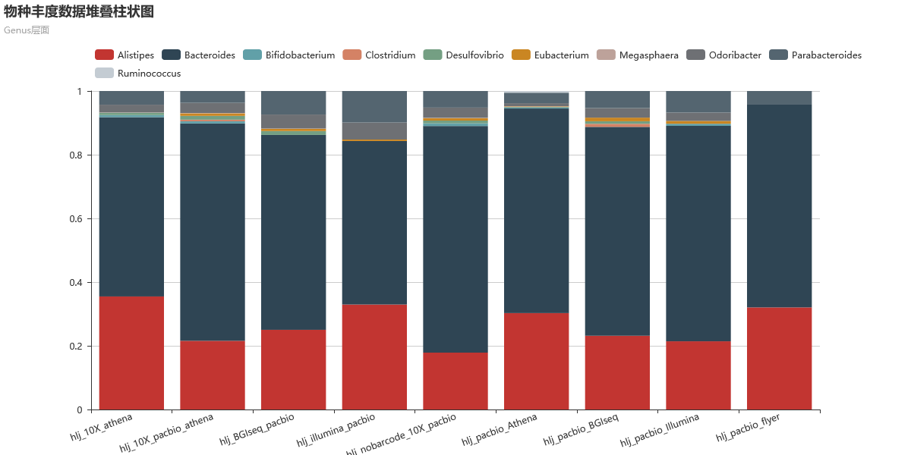
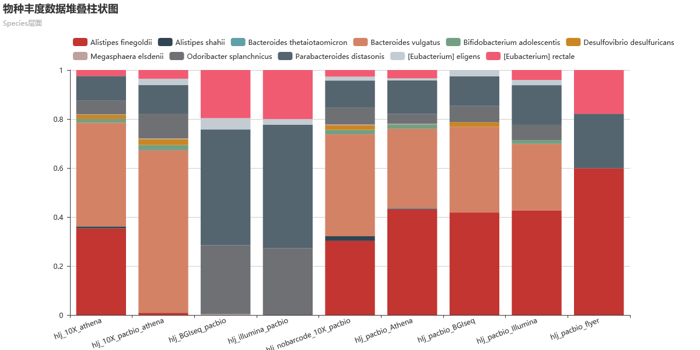

MAEP(Metagenomics Assebly Evaluation Pipeline)
==============

### E-mail: liaoherui@mail.dlut.edu.cn
### Version: V2.0

--------------

### Abstract
MAEP is a new version of LAEP and can be used to evaluate the assembly quality of metagenomics 
data(especially from the different sequencing platforms and different assembly strategies).By the
way ,this pipeline can support multiple samples parallel evaluation.  
**However,MAEP can only run on KMBGI's server.It will be updated to run on other servers soon after.**

### Manuals
* Step 1: Finish the MAEP.conf profile
* Step 2: Python go.1.py.Then,sh overall/qsub.sh and sh Submit/qsub.sh.Wait until jobs finish.
* Step 3: Python go.2.py

### Output
There are two parts of output.One is report(.html),another is literature figure.

Report Part:  
1.Overall contig N50 value

  

2.Bin quality bar plot.(Build with pyechart)

  

3.Bin quality stack bar plot.(Build with pyechart)

  

4.Bin completeness/contamination scatter plot.(Build with pyechart)

  

5.Genus/Species upset plot.(Build with R)

  

6.Bins N50 and coverage.(Overall and each bin)

  

  

7.Genus/Species abundance stack bar.

  

  

**For more details,you can download the  new_output_example dir to have a look at the output report and figure.**

