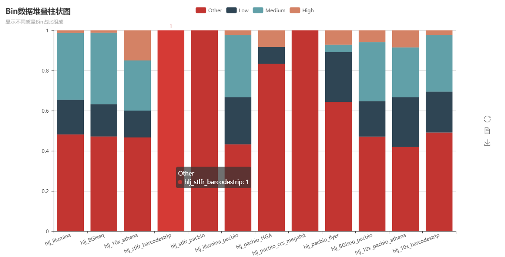

MAEP(Metagenomics Assembly Evaluation Pipeline)
==============


### E-mail: liaoherui@mail.dlut.edu.cn
### Version: V3.0

--------------
**This is not a production-ready software repository and is still under active development. Bugs and feature requests will not addressed. Note:MAEP can only be used on KMBGI's server.It will be updated to run on other servers soon after**

### Abstract
MAEP is a new version of LAEP and can be used to evaluate the assembly quality of metagenomics 
data(especially from the different sequencing platforms and different assembly strategies).By the
way ,this pipeline can support multiple samples parallel evaluation.<BR/><BR/>

The program is broken down into several module:<BR/><BR/>

* Module 1: Assess contig/scaffold quality with **Quast v5.0.0**
* Module 2: Binning contig/scaffold with **MaxBin 2.2.4**
* Module 3: Map raw reads to contig/assembly and calculate the map rate with **BWA 0.7.17**
* Module 4: Evaluate the bins generated by Maxbin and output the **bin table**.<BR/>
  ( Please note that this module will use **Checkm v1.0.12**(Assess bins quality),**Quast v5.0.0**(Assess bin quality), **Kraken 0.10.6**(Annotation),**Aragorn v1.2.38, Barrnap 0.9,Prodigal v2.6.3**(These three tools are used to annotate RNA info) )
* Module 5: Plot according to the **bin table**.


### Manuals
* Quick Start:<BR/>
  `python Lazy_MAEP.py -l list/contig_raw_reads.list -s list/sample.list -o zxy_p4_test `<BR/>
  By the way,you can put this command into a bash script and use it.
* Option Illustration:<BR/>
 **-l** : <BR/>
This option refers to the input list.The list **(tab seperated)** is composed of 4 parts.<BR/>
**column 1: sample name**<BR/>
**column 2: prefix (Usuallly refer to different sequencing platforms or assembly strtegies)**<BR/>
**column 3: assembly result dir(.fasta file with multi contigs/scaffolds)**<BR/>
**column 4 and column 5: PE raw reads dir**<BR/>
**Example List:(One sample ,two sequencing platforms)** 
<BR/>
 ```
 zxy Athena_10X  /mnt/10X_athena.fasta /mnt/osf1/zxy_10X_R1.fq.gz  /mnt/osf1/zxy_10X_R2.fq.gz 
 zxy Illumina /mnt/pacbio_flye.fasta  /mnt/osf1/zxy_1.fq.gz /mnt/osf1/zxy_2.fq.gz
 ```
<BR/>
 **-s** : <BR/>
 This option refers to the sample name list.For example,if your input data only refers to one sample(zxy,for example), then your sample list should be:<BR/>
 ```
 zxy
 ```
 <BR/>
 Or, you have two samples,then,your list should be:<BR/>
 ```
 zxy
 Sample2-Name
 ```
 <BR/>
,more samples condition is similar.
 
 
* Step 1: Finish the MAEP.conf profile
* Step 2: Python go.1.py.Then,sh overall/qsub.sh and sh Submit/qsub.sh.Wait until jobs finish.
* Step 3: Python go.2.py


### Output
There are two parts of output.One is report(.html),another is literature figure.

Report Part:<BR/><BR/>
1.Overall contig N50 value
<p align="center">
  
</p>

2.Bin quality bar plot.(Build with pyechart)
<p align="center">
  
</p>

3.Bin quality stack bar plot.(Build with pyechart)
<p align="center">
  
</p>

4.Bin completeness/contamination scatter plot.(Build with pyechart)
<p align="center">
  
</p>

5.Genus/Species upset plot.(Build with R)
<p align="center">
  
</p>

6.Bins N50 and coverage.(Overall and each bin)

<p align="center">
  
</p>
<p align="center">
  
</p>

7.Genus/Species abundance stack bar.
<p align="center">
  
</p>
<p align="center">
  
</p>

**For more details,you can download the  new_output_example dir to have a look at the output report and figure.**

